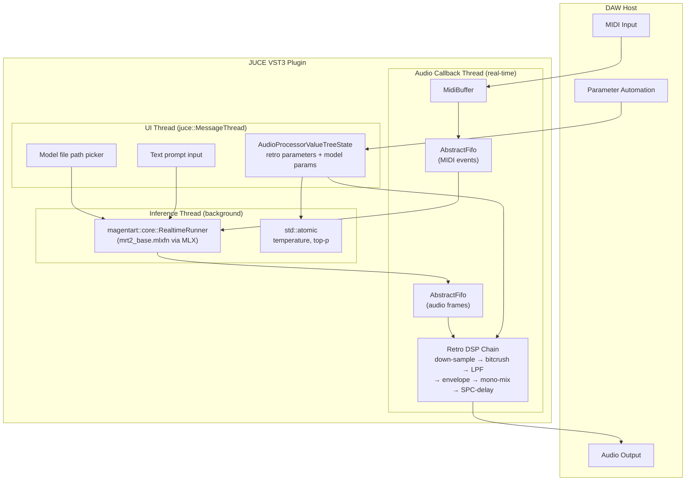

## Summary

Build a JUCE-based VST3 plugin from scratch that wraps the mrt2_base (2.4B) real-time music model as a synthesis engine, with a hybrid approach to retro RPG "soundfonts" aesthetics (inspired by SNES/Genesis-era Final Fantasy and Donkey Kong): text prompt conditioning + bundled reference audio clips from free soundfonts shape the model's timbre at generation time, while a lighter post-generation DSP chain adds the final lo-fi polish. The plugin is a **synth** — the user plays MIDI notes in the piano roll, and the plugin generates retro-styled audio per note. The plugin loads the mrt2_base `.mlxfn` model at runtime, accepts MIDI input for real-time note control, runs inference on a background thread via `magentart::core::RealtimeRunner`, and exposes retro-shaping parameters (bit-depth, sample-rate, LPF, envelope, SPC-delay) as automatable VST controls.

## Problem Frame

The magenta-realtime repository provides AUv3 and standalone app examples but no VST3 plugin. FL Studio (the user's target DAW) does not support AUv3 on Windows and recommends VST3 over AU on macOS for cross-platform project compatibility. A JUCE-based VST3 plugin is the right format for broad DAW support.

Meanwhile, mrt2_base generates full-bandwidth, modern-sounding audio. To achieve a retro "soundfonts" character — the warm, crunchy, limited-bandwidth sound of 90s RPGs — the plugin needs a carefully designed post-processing chain that emulates the DAC encoding, sample-rate limitations, and envelope characteristics of classic ROM-sampled instruments.

## Requirements

### Core Plugin

- R1. VST3 plugin built with JUCE, loadable in FL Studio (macOS and Windows), Ableton Live, and Logic Pro
- R2. Loads mrt2_base `.mlxfn` model file at runtime (user-selectable path)
- R3. Real-time MIDI input: note-on/off mapped to mrt2_base's 128-dim multihot MIDI vector
- R4. Audio output at host sample rate (48 kHz required by mrt2_base; plugin handles this internally)
- R5. Fixed latency reported to host via `setLatencySamples()` so DAW compensates correctly

### Inference Architecture

- R6. `magentart::core::RealtimeRunner` owned by a dedicated background thread, never touched from the audio callback
- R7. Lock-free FIFOs (`juce::AbstractFifo`) for MIDI events (audio thread -> inference thread) and audio frames (inference thread -> audio thread)
- R8. Model parameters (temperature, top-p) exposed as `AudioProcessorValueTreeState` parameters, updated via `std::atomic` for lock-free reads on the inference thread

### Retro Soundfonts DSP Chain

- R9. Post-generation processing chain applied to mrt2_base output before host delivery:
  1. Sample-rate down-sampler (target 22 kHz)
  2. Bit-crusher (8-bit depth, optional dithering)
  3. Low-pass filter (cutoff 6-8 kHz)
  4. Envelope shaper (fast attack, short decay, low sustain)
  5. Stereo width limiter (mono-mix)
  6. Optional SPC-style delay (120 ms, feedback 0.25)
- R10. Each DSP stage exposed as an automatable VST parameter with meaningful range and default

### Conditioning (Hybrid Approach)

- R11. Text prompt input passed to mrt2_base for style conditioning (e.g., "8-bit FM chiptune")
- R11a. Prompt text exposed as a VST parameter (string), persisted in plugin state
- R12. Bundled reference audio clips rendered from free soundfonts (ExpressiveSNES, SNES GM, FF6, DKC2) mapped to instrument presets
- R12a. User selects a **Reference Preset** from a dropdown: "SNES Square Lead," "FF6 Strings," "DKC Pad," "Genesis Lead," etc.
- R12b. On preset selection, the corresponding bundled WAV file is loaded and tokenized via MusicCoCa, then fed as conditioning to the inference engine
- R12c. Reference audio clips are rendered offline from free soundfonts (ExpressiveSNES, SNES GM Soundfont, FF6 Soundfont, DKC2 Soundfont) using tools like Polyphone/FluidSynth — NOT parsed at runtime
- R13. Bundled reference clips stored as WAV files in plugin resources (~5-10 MB total for 10-15 presets)

## Key Technical Decisions

### KTD1: Hybrid conditioning (prompt + bundled reference clips + light DSP) over DSP-only or prompt-only

mrt2_base can be nudged with text prompts like "8-bit chiptune" but has no explicit soundfont token. The model still produces full-bandwidth, modern-sounding audio. A hybrid approach gives the best results: text prompt + bundled reference audio clips (rendered from free soundfonts) condition the model to retro timbres at generation time, while a lighter DSP chain (bitcrush, down-sample, LPF) adds the final lo-fi polish. The DSP becomes seasoning, not the main dish.

**Rationale**: Plogue ChipCrusher and similar plugins prove that DSP alone degrades modern audio without generating true retro timbres. Prompt conditioning alone is too coarse (no explicit soundfont token in the model). Bundled reference clips from free, legal soundfonts (ExpressiveSNES, SNES GM, FF6, DKC2) give the model authentic retro timbres to condition on, while DSP adds the final character.

### KTD2: Dedicated inference thread with lock-free FIFOs

The `RealtimeRunner` performs GPU inference via MLX and must never block the JUCE audio callback. A dedicated `std::thread` owns the runner. MIDI events flow from audio thread to inference thread via a lock-free FIFO (`juce::AbstractFifo`). Generated audio flows back via a second FIFO.

**Rationale**: The magenta-realtime AUv3 example uses this exact pattern. Any mutex or allocation in the audio callback risks xruns.

### KTD3: VST3 over AUv3

FL Studio on Windows does not support AUv3. FL Studio on macOS recommends VST3 over AU for cross-platform project compatibility. JUCE's VST3 target works on both macOS and Windows.

**Rationale**: User explicitly needs FL Studio compatibility. VST3 is the only format that works across all target DAWs and platforms.

### KTD4: User-selectable model path over bundled model

mrt2_base.mlxfn is approximately 2.4 GB. Bundling it inside the plugin would make the installer unwieldy. Instead, the plugin lets the user select the model file path (with a file picker dialog) and persists it in the plugin state.

**Rationale**: Smaller plugin size, user can switch between mrt2_base and mrt2_small, and the model can be shared with other applications.

### KTD5: Internal processing at 48 kHz, retro DSP applied before output

mrt2_base requires 48 kHz input/output. The retro DSP chain (down-sample to 22 kHz, bitcrush, LPF) is applied to the 48 kHz stream, then the result is delivered to the host at 48 kHz. The down-sampling is a DSP effect, not a host sample-rate change.

**Rationale**: Keeps the ML pipeline simple and at the required rate. The retro character is imposed by the processing chain, not by changing the model's operating point.

### KTD6: Bundled reference clips over runtime soundfont loading

Reference audio clips are rendered from free soundfonts (ExpressiveSNES, SNES GM, FF6, DKC2) offline using tools like Polyphone/FluidSynth, then bundled as WAV files in the plugin resources. The user selects from curated presets rather than loading .sf2 files at runtime.

**Rationale**: Runtime soundfont loading requires a full SF2 binary parser, sample decoder (including SNES BRR encoding), envelope generator, and instrument-to-audio rendering pipeline — estimated 2-4 weeks of additional work. Bundled clips are dramatically simpler (~2-3 days), more reliable, and let us curate the best-sounding instruments. Soundfont loading can be added in v2 as a power-user feature.

## High-Level Technical Design

## Implementation Units

### U1. JUCE VST3 Plugin Scaffold

**Goal**: Create a minimal, buildable JUCE VST3 plugin with `AudioProcessor` skeleton, CMake build system, and parameter management.

**Files**:
- `examples/retro_vst/CMakeLists.txt` — CMake build definition for VST3 target
- `examples/retro_vst/PluginProcessor.h` — `AudioProcessor` subclass declaration
- `examples/retro_vst/PluginProcessor.cpp` — `processBlock`, `prepareToPlay`, `createEditor`, parameter layout
- `examples/retro_vst/PluginEditor.h` — `AudioProcessorEditor` subclass declaration
- `examples/retro_vst/PluginEditor.cpp` — Basic UI with parameter controls and model file picker

**Approach**:
- Use JUCE's `juce_audio_plugin_client` module with the VST3 target
- `PluginProcessor` inherits `juce::AudioProcessor` with `juce::AudioProcessorValueTreeState` for parameters
- `PluginEditor` inherits `juce::AudioProcessorEditor` with basic `juce::Slider` and `juce::TextButton` controls
- CMake links against JUCE modules: `juce_audio_utils`, `juce_audio_processors`, `juce_audio_plugin_client`, `juce_gui_basics`, `juce_gui_extra`
- No inference or DSP yet — just a passthrough plugin that accepts MIDI and outputs silence

**Patterns to follow**: JUCE's built-in `examples/Plugins/PluginProcessor.cpp` for the standard VST3 skeleton.

**Test scenarios**:
- Plugin builds and loads in JUCE Plugin Host
- Plugin appears as VST3 in a DAW plugin scan
- `processBlock` receives MIDI events without crashing
- Parameters are exposed and automatable in the host

---

### U2. magentart::core Integration and Inference Thread

**Goal**: Add the mrt2_base model loading, `RealtimeRunner` instantiation, and background inference thread with lock-free FIFOs.

**Files**:
- `examples/retro_vst/InferenceEngine.h` — `InferenceEngine` class: owns `RealtimeRunner`, background thread, FIFOs
- `examples/retro_vst/InferenceEngine.cpp` — Thread entry point, MIDI FIFO read, audio FIFO write, model loading
- `examples/retro_vst/CMakeLists.txt` — Add `magentart::core` as subdirectory, link against it
- `examples/retro_vst/PluginProcessor.cpp` — Instantiate `InferenceEngine`, push MIDI events in `processBlock`, pull audio frames

**Approach**:
- `InferenceEngine` constructed in `PluginProcessor::prepareToPlay()` with model file path
- Two `juce::AbstractFifo` instances: MIDI events (audio -> inference) and audio frames (inference -> audio)
- MIDI FIFO entry: `{uint8_t note, bool isOn, uint8_t velocity}` struct
- Audio FIFO entry: interleaved stereo float buffer (pre-allocated in `prepareToPlay`)
- Background thread runs a loop: read MIDI events -> `handleMidiEvent()` -> `getAudio()` -> write to audio FIFO
- `PluginProcessor::processBlock()` pushes incoming `MidiBuffer` events to MIDI FIFO, pulls from audio FIFO into output buffers
- `setLatencySamples()` called with the runner's internal look-ahead

**Patterns to follow**:
- `magenta/magenta-realtime/examples/mrt2/auv3/MagentaRT_AudioUnit.mm` for the AUv3's FIFO pattern
- `magenta/magenta-realtime/core/realtime_runner.h` for the `RealtimeRunner` API

**Test scenarios**:
- Model loads from a valid `.mlxfn` path without crashing
- Background thread starts and stops cleanly
- MIDI note-on events produce audio output (verify with a test tone or signal)
- Plugin reports correct latency to the host
- No allocations or mutex locks in the audio callback path (verify with Instruments or logging)

---

### U3. Retro Soundfonts DSP Chain

**Goal**: Implement the post-generation DSP chain that transforms mrt2_base output into a retro RPG soundfonts aesthetic.

**Files**:
- `examples/retro_vst/RetroDSP.h` — `RetroDSP` class: owns all DSP stages, processes audio in-place
- `examples/retro_vst/RetroDSP.cpp` — Implementation of each DSP stage
- `examples/retro_vst/PluginProcessor.cpp` — Insert `RetroDSP` between audio FIFO read and host output
- `examples/retro_vst/PluginProcessor.h` — Add `RetroDSP` member, parameter bindings

**Approach**:
- `RetroDSP` processes interleaved stereo float buffers in-place
- Processing order: down-sample -> bitcrush -> LPF -> envelope -> mono-mix -> SPC-delay
- Each stage controlled by `std::atomic<float>` parameters (updated from `AudioProcessorValueTreeState`):
  - `virtualSampleRate` (8000-24000 Hz, default 22050)
  - `bitDepth` (4-12 bits, default 8)
  - `lpfCutoff` (4000-12000 Hz, default 8000)
  - `attackMs` (0-50 ms, default 20)
  - `decayMs` (50-300 ms, default 150)
  - `sustainLevel` (0-0.3, default 0.1)
  - `monoMix` (0-0.5, default 0.3)
  - `spcDelayTime` (0-200 ms, default 120)
  - `spcFeedback` (0-0.5, default 0.25)
- Down-sampler: simple linear interpolation (not a high-quality resampler — the aliasing is part of the retro character)
- Bitcrusher: truncate float to N-bit integer range, scale back to float
- LPF: 1-pole IIR low-pass filter (cheap, retro-sounding)
- Envelope: per-note ADSR applied to the signal amplitude (fast attack, short decay)
- Mono-mix: `out = dry * (1 - mix) + mono * mix` where `mono = (L + R) / 2`
- SPC-delay: simple feedback delay line with feedback gain

**Patterns to follow**: Plogue ChipCrusher's DAC-encoding chain for the overall structure; JUCE's `juce::dsp` module for filter primitives.

**Test scenarios**:
- Bypass all DSP (defaults with mix=0, bit depth=16, LPF=12 kHz) — output matches input
- Maximum retro settings (22 kHz, 8-bit, 6 kHz LPF) — audible aliasing and quantization noise
- SPC-delay produces audible echo at the configured time and feedback
- Parameter changes take effect without clicks or artifacts
- DSP chain adds no measurable latency beyond the inference engine's own

---

### U4. Model Parameters and Hybrid Conditioning

**Goal**: Expose mrt2_base's generation parameters (temperature, top-p), text prompt, and bundled reference preset selection as VST parameters.

**Files**:
- `examples/retro_vst/InferenceEngine.h` — Add `setTemperature()`, `setTopP()`, `setPrompt()`, `setReferenceClip()` methods
- `examples/retro_vst/InferenceEngine.cpp` — Implement parameter updates via `std::atomic`; load and tokenize bundled WAV on reference preset change
- `examples/retro_vst/PluginProcessor.h` — Add parameter bindings for temperature, top-p, reference preset
- `examples/retro_vst/PluginEditor.cpp` — Add text editor for prompt input, dropdown for reference preset selection
- `examples/retro_vst/ReferencePresets.h` — Static map of preset names to bundled WAV resource paths and MusicCoCa token cache
- `examples/retro_vst/resources/` — Bundled WAV files (10-15 reference clips, ~5-10 MB total)

**Approach**:
- `temperature` (0.1-2.0, default 1.3) and `topP` (0.1-1.0, default 0.9) exposed as `AudioProcessorValueTreeState` float parameters
- Inference thread reads these atomically each generation step
- Text prompt: `juce::String` member, updated from UI, passed to runner on next generation cycle
- Reference presets: dropdown in UI maps to bundled WAV files (rendered offline from free soundfonts)
  - Presets: "SNES Square Lead," "FF6 Strings," "DKC Pad," "Genesis Lead," "SNES Pad," "FF6 Organ," etc.
  - On selection change: load WAV from plugin resources, tokenize via MusicCoCa, feed conditioning tokens to runner
  - Tokenization result cached per preset (computed once on selection, not per-frame)
- Model file path: persisted in plugin state via `getStateInformation`/`setStateInformation`
- Reference clip rendering (offline, not in plugin): use Polyphone or FluidSynth to render short (1-2 s) note clips from free soundfonts, save as 48 kHz WAV

**Patterns to follow**: magenta-realtime's AUv3 parameter mapping in `MagentaRT_AudioUnit.mm`.

**Test scenarios**:
- Temperature change affects output randomness (lower = more deterministic)
- Top-p change affects output diversity
- Text prompt change shifts the generation style (audible difference)
- Reference preset selection changes the timbre of generated audio (audible difference between "SNES Square Lead" and "FF6 Strings")
- Model path change triggers reload without plugin restart
- Plugin state save/restore preserves model path, prompt, reference preset, and all parameters
- All bundled WAV files load correctly from plugin resources

---

### U5. UI Polish and Final Integration

**Goal**: Build a polished plugin editor with all controls laid out intuitively, preset management, and final integration testing.

**Files**:
- `examples/retro_vst/PluginEditor.cpp` — Full UI layout with sections: Model, Generation, Retro FX, Conditioning
- `examples/retro_vst/PresetManager.h` — Preset loading/saving for retro sound configurations
- `examples/retro_vst/PresetManager.cpp` — Preset file I/O (JSON-based)

**Approach**:
- Four UI sections:
  1. **Model**: file path display + browse button, model info (size, loaded status)
  2. **Generation**: temperature slider, top-p slider, prompt text editor, reference preset dropdown
  3. **Retro FX**: virtual sample-rate, bit-depth, LPF cutoff, envelope (attack/decay/sustain), mono-mix, SPC-delay (time/feedback)
  4. **Presets** (integrated): "SNES RPG", "Genesis Lead", "8-Bit Chiptune", "Warm Pad" — each sets all retro parameters AND reference preset to curated values
- Visual feedback: simple level meter showing output signal
- Plugin name: "Magenta Retro" or similar

**Patterns to follow**: JUCE's `juce::AudioProcessorValueTreeState::SliderAttachment` for automatic parameter-to-UI binding.

**Test scenarios**:
- All sliders update parameters in real-time
- Preset selection changes all parameters correctly
- Plugin loads in FL Studio (macOS) and appears in plugin list
- Plugin loads in Ableton Live and Logic Pro
- MIDI keyboard input produces audible, retro-processed audio
- No xruns or audio glitches during normal playback

---

## Scope Boundaries

### In Scope
- VST3 plugin format only (no AUv3, no standalone app)
- macOS and Windows build support
- mrt2_base model (2.4B) as the synthesis engine
- Post-generation DSP chain for retro sound shaping
- MIDI input for real-time note control
- Text prompt and bundled reference audio conditioning (hybrid approach)
- Basic parameter UI with soundfont-style preset system

### Deferred to Follow-Up Work
- mrt2_small model variant support (smaller, faster, lower quality)
- Custom model fine-tuning for retro styles
- Advanced UI with waveform/spectrum visualization
- CLAP plugin format support
- AUv3 variant for macOS-only users
- Standalone app variant
- Windows GPU acceleration via DirectML or Vulkan (MLX is Apple Silicon only)
- Runtime soundfont (.sf2) loading — requires SF2 parser, sample decoder, envelope generator, instrument-to-audio rendering pipeline (~2-4 weeks work)
- User reference audio file loading (upload custom WAV for conditioning)
- Additional reference presets beyond the bundled set

### Outside This Product's Identity
- DAW development or hosting
- Model training or dataset curation
- Soundfont file (.sf2) import/export
- Multi-model blending or switching at runtime

## Risks & Dependencies

| Risk | Impact | Mitigation |
|------|--------|------------|
| mrt2_base requires Apple Silicon Pro/Max for real-time inference | Plugin won't run real-time on base M-series or Intel Macs | Detect chip at startup; warn user; offer mrt2_small as fallback |
| MLX runtime is Apple Silicon only | No Windows or Intel macOS support for inference | Document platform limitation; consider ONNX export for Windows in future work |
| 2.4 GB model file size | Long load times, large disk requirement | Lazy-load model on first use; show loading progress in UI |
| Real-time inference latency (~200 ms) | Notes feel delayed | Report latency to host via `setLatencySamples()`; host compensates |
| JUCE VST3 SDK requires Steinberg SDK | Build complexity | Use JUCE's built-in VST3 wrapper (no separate SDK needed) |
| DSP chain adds CPU overhead | Increased CPU usage beyond inference | Profile and optimize; each stage is lightweight (1-pole IIR, integer truncation) |

## Sources & Research

- **magenta-realtime core library**: `magenta/magenta-realtime/core/realtime_runner.h` — `RealtimeRunner` API for streaming inference
- **magenta-realtime AUv3 example**: `magenta/magenta-realtime/examples/mrt2/auv3/MagentaRT_AudioUnit.mm` — reference for FIFO pattern and parameter mapping
- **JUCE plugin skeleton**: `WeAreROLI/JUCE/examples/Plugins/PluginProcessor.cpp` — standard VST3 plugin structure
- **JUCE CoreML demo**: `WeAreROLI/JUCE/examples/Plugins/CoreMLDemo/PluginProcessor.cpp` — pattern for ML model ownership in JUCE plugin
- **Plogue ChipCrusher**: reference for retro DAC-encoding DSP chain (down-sample, bitcrush, LPF, SPC-delay)
- **GeneralUser GS SoundFont** (mrbumpy409/GeneralUser-GS on GitHub): free GM/GS soundfont, 30 MB, for rendering reference clips
- **ExpressiveSNES** (musical-artifacts.com): high-quality SNES sample soundfont, free, for rendering SNES-style reference clips
- **SNES GM Soundfont** (dotsarecool via musical-artifacts.com): 95K+ downloads, actual SNES game samples
- **Final Fantasy 6 Soundfont** (williamkage.com via musical-artifacts.com): direct FF6 instruments
- **Donkey Kong Country 2 Soundfont** (musical-artifacts.com): DKC2-specific sounds
- **Woolyss Chipmusic Soundfonts** (woolyss.com): comprehensive list of free retro game soundfonts
- **FL Studio plugin standards**: FL Studio supports VST3 on both macOS and Windows; recommends VST3 over AU for cross-platform compatibility
- **Community JUCE-MLX demo**: `gadgeteers/juce-mlx-demo` — minimal JUCE plugin loading `.mlxfn` models
- **Polyphone**: free soundfont editor, used to render reference clips from SF2 files to WAV
- **FluidSynth**: command-line soundfont renderer, alternative for batch-rendering reference clips

